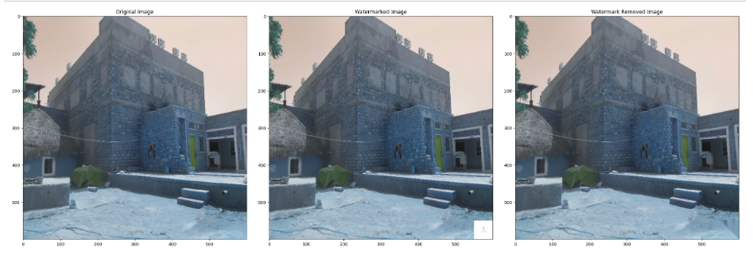
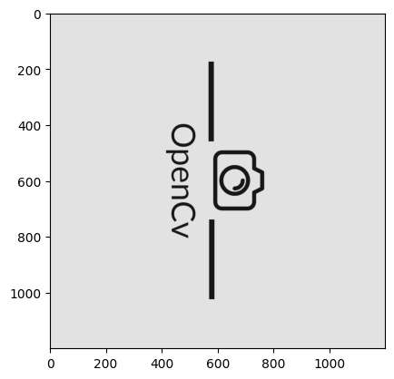
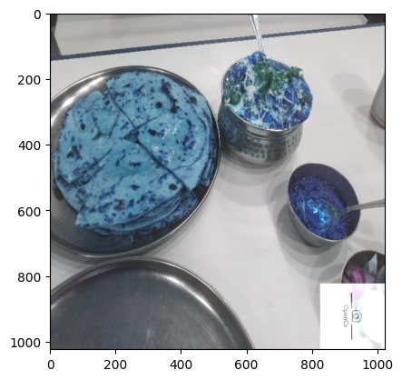
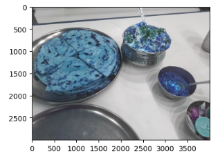
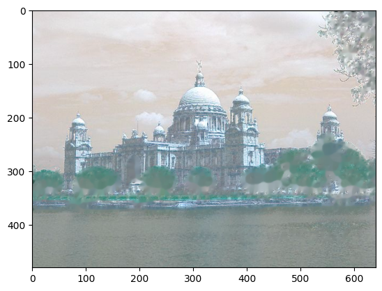
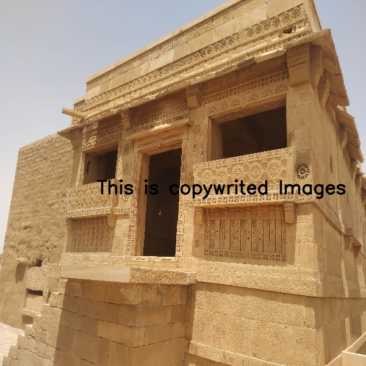
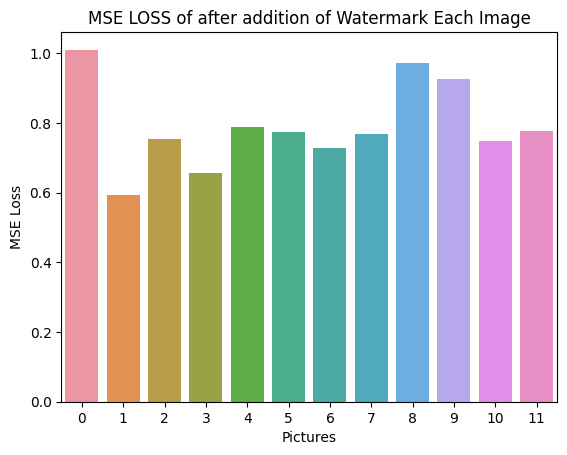
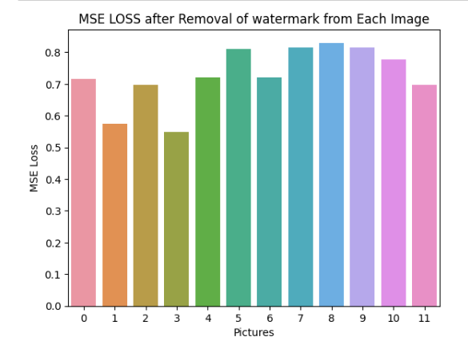

# CV_Project 
# TITLE: WATERMARKING IN IMAGES 

## Overview

This is a Computer Vision project focused on exploring different ways of protecting image copyright through image watermarking and identifying potential flaws in the process. The project aims to implement watermarking techniques, such as visible and invisible watermarking through logos and text, and evaluate their effectiveness in protecting copyright. It also explores potential flaws or weaknesses in the watermarking process and develops strategies to strengthen image protection. Additionally, the project uses evaluation measures to check watermarking techniques used and provides results accordingly for comparison purposes. 

#### Name of Students:
##### 1. Vandita Agarwal(M20MA208)
##### 2. Shilajit Banerjee(M22CS062)
##### 3. Dattatreyo Roy(M22CS060)

This is the Computer Vision project 1.

The main objective of the project is to explore different ways of protecting image copyright through image watermarking and identifying potential flaws in the process.
The project will implement watermarking techniques such as visible and invisible watermarking through logos and text and evaluate their effectiveness in protecting copyright.
After then it will implement techniques to remove that watermark from the watermarked images, so as to receive almost original images again. The project will also explore potential flaws or weaknesses in the watermarking process and develop strategies to strengthen image protection. Ultimately, it will also use evaluation measures to check watermarking techniques used and give results accordingly, so that we could compare these techniques. 

## Normal Watermark

Here is the logo we have used for watermarking purpose. 

   
 

After adding this and removing we got the following images:  

   

We have also used text at random positions for watermarking as well. As you can see - 
 

  

### Techniques

For removal of the watermark we have used different techniques. Like for image watermark removal we have used the following methods -
For the detection of the watermark the methods used are-
1. Template Matching 
2. Sift 
3. ORB 
 After detecting these we have used inpainting method to remove the image watermark. We have tried to do by replacing the mean value of the pixels but that didnot gave good results.  

## Rotated Watermark

Another aspect of our project is the rotated watermark. We will be adding the same image watermark but that will be rotated so, that finding the watermark in the image becomed difficult. In such cases ORB, SIFT methods have worked well. Here is an example of rotated watermark-   

   

 
Here in the example you can see we have added the rotated watermark -   

   

 
After removing this we got -   

   

 

## Text Watermarking

In addition to image watermarking, we also explored watermarking techniques using text. For this, we randomly placed text in various locations on the images to be watermarked.

To detect the text watermark, we used state-of-the-art OCR (Optical Character Recognition) methods. Here's an example of an image with a text watermark:

  

After detecting the watermark, we used inpainting methods to remove it from the image. Here's an example of an image after removing the text watermark:

   

For text detection and removal we have used sate of the art OCR methods. Like you can see below->  

   

After removing this got the following result -  

   

We have also used text at random positions for watermarking as well. 

Overall, our results indicate that our text watermarking technique is effective at protecting the copyright of the images while maintaining a relatively low level of distortion. However, there is still room for improvement, and we plan to continue exploring and refining our techniques in future work. 

### Evaluation Metrics

For evaluating the watermarking techniques, we have used different loss functions to calculate the loss between the (original image, watermarked image) and (original image, watermark-removed image). The loss functions we have used are:
The used evaluation metrices are-
1. MSE Loss  
2. Log Loss  
3. Pairwise Loss  
We have calculated the loss for each pairs. I am giving an example of loss plot -   

   

 
As we can see the loss after adding the watermark and It's in the range of 1 which is good. That means we are changing very few pixels in the image. 
After removing these watermark here is the loss -   

   

## Invisible Watermarking

Here, we are trying to add an invisible watermark to our input image. The process involves defining the text to be used as the watermark and converting it to a binary image which is then embedded into the original image using alpha blending. The alpha parameter determines the transparency of the watermark, with a smaller alpha value resulting in a more subtle watermark. Finally, the resulting watermarked image is saved as an output image.

## Conclusion
In conclusion, this project has explored various watermarking techniques and evaluated their effectiveness in protecting image copyright. We have also identified potential flaws in the watermarking process and developed strategies to strengthen image protection. By using evaluation metrics, we have compared different watermarking techniques and provided results accordingly. 
